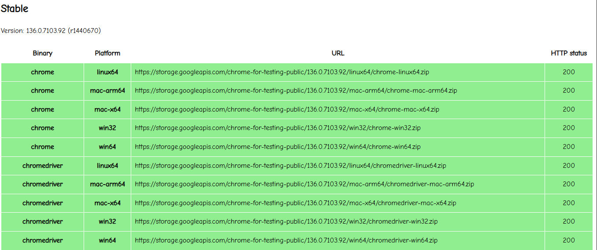

# How to Use This Repository

Wait until the page on port 5000 appears, and everything will be set up.

OR

you can run these cmd:

```bash
flask --debug run --host=0.0.0.0
python test_data.py
```

## Commands That Might Help

### Flask Commands

Run the following commands to manage the Flask application:

```bash
# Initialize the migration repository
flask db init

# Generate an initial migration
flask db migrate -m "Initial migration."

# Apply the migration to the database
flask db upgrade

# Generate a new migration after making changes to the models
flask db migrate -m "Description of changes."

# Apply the new migration to the database
flask db upgrade
```

### How to Modify Columns in Existing Database

If you need to modify some columns in the existing database, follow these steps:

1. Manually delete the table from the database.
2. Run the following commands to apply the changes:

```bash
# Apply the migration to the database
flask db upgrade

# Generate a new migration after making changes to the models
flask db migrate -m "Description of changes."

# Apply the new migration to the database
flask db upgrade
```

## To use Copilot on the website, you need to install Google Chrome on Linux

### How to Check Chrome and ChromeDriver Versions

Run the following commands to check the versions:

```bash
# Check Chrome version
google-chrome --version

# Check ChromeDriver version
./chromedriver-linux64/chromedriver --version
```

### Different Google Chrome Versions

You can find different versions of Google Chrome at the following URL:

[https://googlechromelabs.github.io/chrome-for-testing/](https://googlechromelabs.github.io/chrome-for-testing/)


## Example

Download the **latest version**, and make sure you are using the **same version** for Chrome & ChromeDriver

### Stable

| Binary       | Platform | URL                                            |
| ------------ | -------- | ---------------------------------------------- |
| Chrome       | Linux64  | https://xxx/136.x.x.x/chrome-linux64.zip       |
| ChromeDriver | Linux64  | https://xxx/136.x.x.x/chromedriver-linux64.zip |

### How to download Google Chrome (.deb)

Run the following commands:

```bash
# Download the Google Chrome .deb file
wget https://dl.google.com/linux/direct/google-chrome-stable_current_amd64.deb

# If you encounter dependency issues, run the following commands to fix broken packages
sudo apt update
sudo apt --fix-broken install -y

# Install the .deb file
sudo apt install ./google-chrome-stable_current_amd64.deb -y
```

### How to download Chrome & ChromeDriver (.zip)

Run the following command to download ChromeDriver:

```bash
curl -O https://storage.googleapis.com/chrome-for-testing-public/136.0.7103.92/linux64/chrome-linux64.zip

curl -O https://storage.googleapis.com/chrome-for-testing-public/136.0.7103.92/linux64/chromedriver-linux64.zip

unzip chrome-linux64.zip
unzip chromedriver-linux64.zip

rm chrome-linux64.zip
rm chromedriver-linux64.zip
```

### How to Create Translations

Run the following commands to set up and create translations:

```bash
cd app/
mkdir translations
pybabel extract -F babel.cfg -k lazy_gettext -o translations/messages.pot .
pybabel init -i translations/messages.pot -d translations -l en
pybabel init -i translations/messages.pot -d translations -l ja
pybabel init -i translations/messages.pot -d translations -l zh
pybabel compile -d translations
```

### How to Update Translations

Run the following commands to update existing translations:

```bash
cd app/
pybabel extract -F babel.cfg -k lazy_gettext -o translations/messages.pot .
pybabel update -i translations/messages.pot -d translations
pybabel compile -d translations
```

### Additional Resources

- [Download Chrome and ChromeDriver](https://getwebdriver.com/chromedriver)
- [Gemini API Quickstart Guide](https://ai.google.dev/gemini-api/docs/quickstart?hl=zh-tw&lang=python)
- [CSS Inspiration](https://codepen.io/topics/)


> **Important Note**
>
>After creating or updating translations, remember to re-run the Flask application to apply the changes:
>
>```bash
>flask --debug run --host=0.0.0.0
>```
